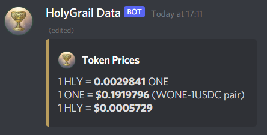

## Discord Webhook Bot for displaying live (cached) prices of HLY and ONE

### Requirements

1. [`discordx`](https://discord-ts.js.org/docs/installation): Version 16.6.0 or newer of Node.js is required
2. OAuth2 discord bot settings: https://discord-ts.js.org/docs/decorators/commands/slash/
3. Create a `secrets.ts` in the root folder with the following:

```
export const DISCORD_BOT_TOKEN = 'bbb';
export const DISCORD_REALTIME_CHANNEL_ID = 'ccc';    // create a locked channel; ID can be obtained by right-clicking channel and selecting "Copy ID"
export const DISCORD_REALTIME_CHANNEL_WEBHOOK_ID = 'ddd';    // see below for getting this info from discord
export const DISCORD_REALTIME_CHANNEL_WEBHOOK_TOKEN = 'eee';
```

### Configuring Discord Bot

1. See https://discord-ts.js.org/docs/decorators/commands/slash#authorize-your-bot-to-use-application-commands for authorising the bot
2. See https://support.discord.com/hc/en-us/articles/228383668-Intro-to-Webhooks for discord webhooks; create it for the specific (read-only) channel: first part is the webhook ID, second part is the webhook token

### Running the Application

`yarn build` then `yarn start`. After the application loads, you should see something like this in your discord voice channel:


